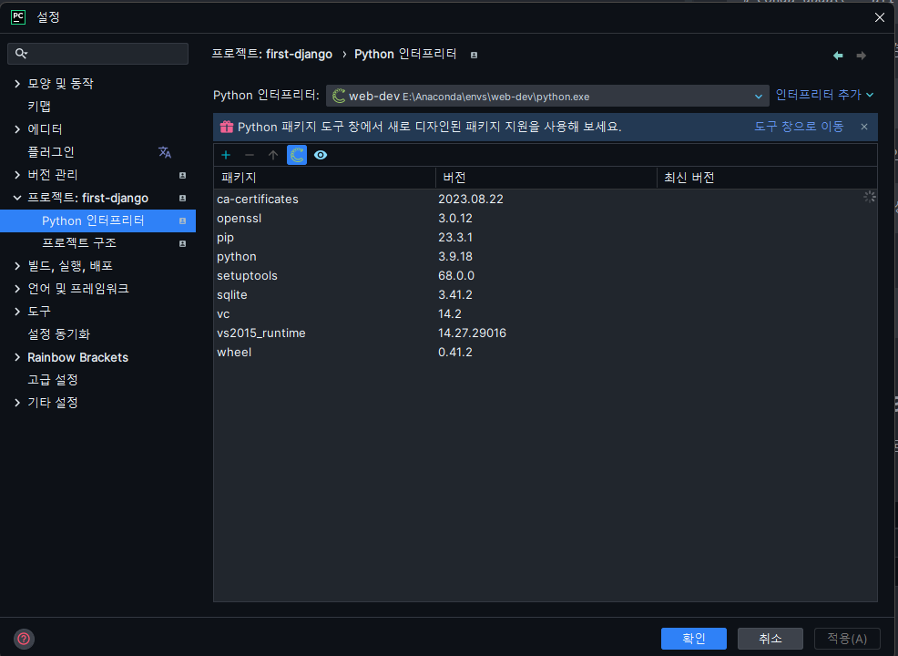
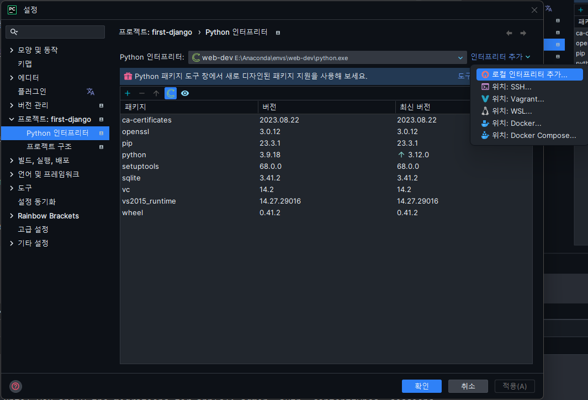
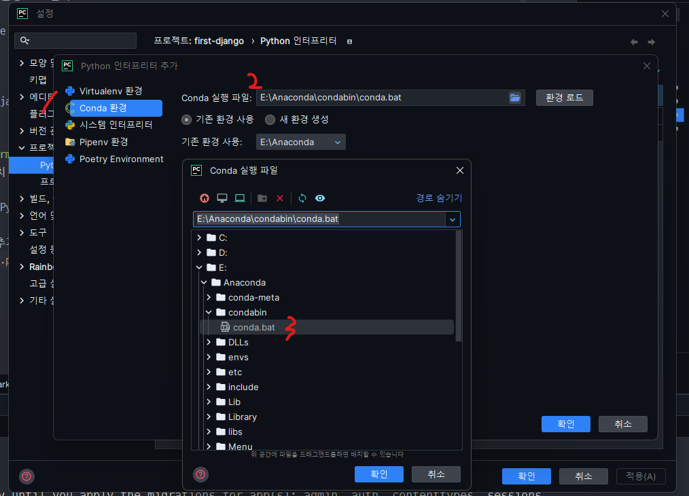

# 1. 환경설정 및 Django 설치

- <b style="color:#FF6347">python 가상환경은 python virtualenv이 아닌 Anaconda를 사용해 설정</b>
- <b style="color:#FF6347">IDE는 PyCharm</b>

1. Anaconda 설치
2. Anaconda 설치 후 터미널 실횅 Anaconda 실횅 <br/>
   시작 -> Anaconda -> Anaconda Prompt 관리자 권한으로 실행<br/>
   또는 터미널에서 <code>conda activate</code> 실행
3. Anaconda 및 패키지 업데이트

```
$ conda update conda -y  // ananconda 업데이트
$ conda update --all -y // 기본으로 설치 되어있는 패키지 업데이트
```

4. Anaconda 가상환경 생성

```
$ conda -n [가상환경 이름] python=[python version]
```

5. 생성 한 가상환경으로 접속

```
$ conda activate [가상환경 이름]
```

6. Djongo 설치

```
$ pip install Django
```

## PyCharm 인터프린터 설정(Windows)

1. Anaconda 설치 경로 확인
2. PyCharm 설정
3. 프로젝트 -> Python 인터프린터
   
4. 인터프린터 추가 -> 로컬 인터프린터 추가
   
5. Conda 환경 -> conda 실행 파일 경로 -> Anaconda 설치 경로\condabin\conda.bat선택 -> 확인 ->  </br>기존환경 사용 선택(자신이 만든 가상환경)
   
